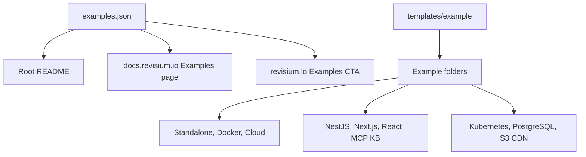

# Revisium Examples

Quickstarts, bootstrap configs, and compact developer contexts for building with Revisium.

Use this repository when you want to see Revisium in a real application shape:

- as a dictionary service for backend teams
- as a remote configuration and feature-flag source
- as a headless CMS or public content API
- as an MCP-accessible knowledge base for AI agents
- as a standalone, Docker, Kubernetes, or managed Cloud service

The examples are intentionally small. Full framework applications should live in separate project repositories; this repo keeps the bootstrap config, environment contract, and minimal code context needed to understand each integration.
For the built-out examples that live in this repo, the catalog files stay at `apps/<name>/` and the runnable app lives in `apps/<name>/project/`.

## Start Here

| Path | What it shows | Best first audience |
| --- | --- | --- |
| [`quickstarts/standalone`](./quickstarts/standalone) | Zero-config local Revisium with embedded storage | Any developer |
| [`quickstarts/docker-compose`](./quickstarts/docker-compose) | Local Docker Compose with PostgreSQL | Backend developers |
| [`quickstarts/cloud`](./quickstarts/cloud) | Managed Revisium Cloud project, API endpoint, and MCP access | Product teams, agents |
| [`apps/nestjs-dictionary-service`](./apps/nestjs-dictionary-service) | NestJS reads typed reference data from Revisium | Backend teams |
| [`apps/nextjs-remote-config`](./apps/nextjs-remote-config) | Next.js consumes runtime settings and public content | Web teams |
| [`apps/react-feature-flags`](./apps/react-feature-flags) | React app reads flags without redeploying | Frontend teams |
| [`apps/mcp-knowledge-base`](./apps/mcp-knowledge-base) | AI agent reads structured KB data through MCP | AI/product teams |

## Mode Matrix

Every application example should explain how to run against each supported Revisium mode.

| Mode | Endpoint shape | Use when |
| --- | --- | --- |
| Standalone | `http://localhost:9222` | Fastest local development and demos |
| Docker Compose | `http://localhost:8080` | Local integration with PostgreSQL, Redis, or S3 |
| Revisium Cloud | `https://cloud.revisium.io` | Managed environments, public demos, agent access |
| Kubernetes | Environment-specific public or internal URL | Self-hosted staging and production |

## Run

| Task | Command | Notes |
| --- | --- | --- |
| Install validation tools | `npm install` | Generates the lockfile and installs ESLint/test tooling |
| Validate catalog, tests, and lint | `npm run validate` | Checks metadata, README sections, node:test tests, ESLint, and Sonar ESLint report |
| Run standalone quickstart | `npx @revisium/standalone@latest` | See `quickstarts/standalone` |
| Run Docker quickstart | `cd quickstarts/docker-compose && docker compose up -d` | Requires `.env` copied from `.env.example` |
| Bootstrap NestJS demo data | `npm run bootstrap:nestjs` | Creates dictionary tables, rows, and generated endpoints |
| Bootstrap Next.js demo data | `npm run bootstrap:nextjs` | Creates remote config tables, rows, and generated endpoints |
| Bootstrap React demo data | `npm run bootstrap:react` | Creates feature flag tables, rows, and generated endpoints |
| Bootstrap MCP KB demo data | `npm run bootstrap:mcp-kb` | Creates knowledge-base tables, rows, and generated endpoints |

## Architecture



## Revisium Tables

The repository itself does not create a Revisium project. Each app README must define its own table model.

| Example | Project | Main tables |
| --- | --- | --- |
| `nestjs-dictionary-service` | `dictionary` | `FaqCategory`, `FaqItem`, `Country`, `Currency` |
| `nextjs-remote-config` | `web-config` | `FeatureFlag`, `PageCopy`, `Plan` |
| `react-feature-flags` | `frontend-config` | `FeatureFlag` |
| `mcp-knowledge-base` | `knowledge-base` | `facts`, `decisions`, `tasks`, `modules` |

## Verify

```bash
npm run validate
```

## Repository Layout

```text
apps/
  mcp-knowledge-base/
    project/
  nestjs-dictionary-service/
    project/
  nextjs-remote-config/
    project/
  react-feature-flags/
    project/

quickstarts/
  cloud/
  docker-compose/
  docker-compose-s3/
  standalone/

infrastructure/
  kubernetes/
    cloud/
    external-postgres/
    s3-cdn/

templates/
  example/
  env/
  secrets/
```

## Example Contract

Each example must include:

- `README.md` following [`templates/example/README.md`](./templates/example/README.md)
- `example.json` metadata for the website/docs catalog
- application examples: `.env.example`, `bootstrap.config.json`, and `scripts/bootstrap.mjs`
- runnable app examples: `project/README.md`, `project/package.json`, and source files under `project/src/`, `project/app/`, `project/pages/`, or another framework-standard source folder.
- application `.env.example` files should use one `REVISIUM_URL` in `revisium://host/org/project/branch` format
- framework app code should stay minimal here; full runnable apps belong in separate project repositories
- no real secrets or customer data
- a clear list of supported modes: standalone, docker, cloud, or kubernetes
- a verification command or manual smoke test

Run the catalog check before opening a PR:

```bash
npm run validate
```

## Docs And Website

- [`docs/docs-and-website-integration.md`](./docs/docs-and-website-integration.md) defines how this repo should be linked from `docs.revisium.io` and `revisium.io`.
- [`docs/marketing-strategy.md`](./docs/marketing-strategy.md) defines the examples-led marketing funnel.
- [`docs/domain-demo-rules.md`](./docs/domain-demo-rules.md) defines what every application/domain demo must cover.
- [`examples.json`](./examples.json) is the future single source for docs and landing-page cards.

## Related Repositories

- [`revisium/revisium`](https://github.com/revisium/revisium)
- [`revisium/revisium-core`](https://github.com/revisium/revisium-core)
- [`revisium/revisium-endpoint`](https://github.com/revisium/revisium-endpoint)
- [`revisium/revisium-admin`](https://github.com/revisium/revisium-admin)
- [`docs.revisium.io`](https://docs.revisium.io)
- [`revisium.io`](https://revisium.io)
