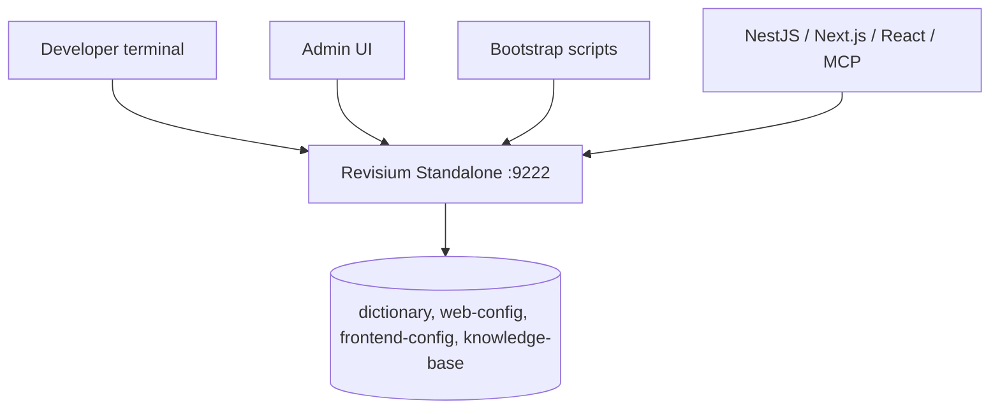

# Revisium Examples

Small standalone examples for building with Revisium locally.

Use this repo when you want to bootstrap demo data, run a small framework app,
and inspect the result in the Revisium Admin UI. Every example targets one local
Revisium Standalone process on `http://localhost:9222`.

## Start Here

| Path | What it shows |
| --- | --- |
| [`quickstarts/standalone`](./quickstarts/standalone) | Start local Revisium and manage data in the Admin UI |
| [`apps/nestjs-dictionary-service`](./apps/nestjs-dictionary-service) | NestJS reads typed dictionary/reference data |
| [`apps/nextjs-remote-config`](./apps/nextjs-remote-config) | Next.js reads runtime config and page copy |
| [`apps/react-feature-flags`](./apps/react-feature-flags) | React reads public feature flags |
| [`apps/mcp-knowledge-base`](./apps/mcp-knowledge-base) | MCP server reads a structured knowledge base |

## Prerequisites

Install Node.js 22.13.0 or newer. Node.js includes `npm` and `npx`.

Check your version:

```bash
node --version
npm --version
```

## Run

Install repo dependencies once:

```bash
npm install
```

Start Revisium Standalone in terminal 1:

```bash
npx @revisium/standalone@latest
```

Open the Admin UI:

```text
http://localhost:9222
```

Local standalone runs without auth by default.

Bootstrap scripts use the committed CLI workspace config at
[.revisium/revisium-cli.config.json](./.revisium/revisium-cli.config.json).
The config stores only local target metadata and `authMode: "none"`; it does not
store credentials.

Bootstrap demo data in terminal 2:

```bash
npm run bootstrap:all
```

You can run one bootstrap command or all demos with `bootstrap:all`. Run
bootstrap commands sequentially; one standalone process can host every demo, but
parallel writes can conflict while projects are being created. Each demo uses a
separate project under the local `admin` organization:

| Command | Project |
| --- | --- |
| `npm run bootstrap:all` | all projects below |
| `npm run bootstrap:nestjs` | `dictionary` |
| `npm run bootstrap:nextjs` | `web-config` |
| `npm run bootstrap:react` | `frontend-config` |
| `npm run bootstrap:mcp-kb` | `knowledge-base` |

Stop standalone from terminal 1:

```text
Ctrl+C
```

## Run A Demo App

Bootstrap the matching Revisium project first, then run the app from its
`project/` folder.

NestJS:

```bash
npm run bootstrap:nestjs
cd apps/nestjs-dictionary-service/project
cp .env.example .env
npm install
npm run build
npm start
```

Next.js:

```bash
npm run bootstrap:nextjs
cd apps/nextjs-remote-config/project
cp .env.example .env
npm install
npm run dev
```

React:

```bash
npm run bootstrap:react
cd apps/react-feature-flags/project
cp .env.example .env
npm install
npm run dev
```

MCP knowledge base:

```bash
npm run bootstrap:mcp-kb
cd apps/mcp-knowledge-base/project
cp .env.example .env
npm install
npm run build
npm start
```

## Check Standalone

Check whether standalone is already running:

```bash
curl -fsS http://localhost:9222 >/dev/null && echo "standalone is up" || echo "start standalone first"
```

Find the process that owns port `9222`:

```bash
lsof -iTCP:9222 -sTCP:LISTEN
```

If `npx @revisium/standalone@latest` returns `EADDRINUSE`, another standalone
process is already running. Reuse it or stop it before starting a new one.

## Architecture



## Revisium Tables

| Example | Project | Main tables |
| --- | --- | --- |
| `nestjs-dictionary-service` | `dictionary` | `FaqCategory`, `FaqItem`, `Country`, `Currency` |
| `nextjs-remote-config` | `web-config` | `FeatureFlag`, `PageCopy`, `Plan` |
| `react-feature-flags` | `frontend-config` | `FeatureFlag`, `AudienceSegment`, `Asset` |
| `mcp-knowledge-base` | `knowledge-base` | `facts`, `decisions`, `tasks`, `blockers`, `sessions` |

## Verify

```bash
npm run validate
```

This checks the catalog, README sections, bootstrap configs, tests, ESLint, and
Sonar ESLint export.

## Repository Layout

```text
apps/
  mcp-knowledge-base/
    project/
  nestjs-dictionary-service/
    project/
  nextjs-remote-config/
    project/
  react-feature-flags/
    project/

quickstarts/
  standalone/

templates/
  example/
```

## Example Contract

Each example must include:

- `README.md` following [`templates/example/README.md`](./templates/example/README.md)
- `example.json` metadata for the website/docs catalog
- standalone-only `modes: ["standalone"]`
- application examples: `.env.example`, `bootstrap.config.json`, and `scripts/bootstrap.mjs`
- runnable app examples: `project/README.md`, `project/package.json`, and source files under the framework-standard source folder
- application `.env.example` files using one `REVISIUM_URL` in `revisium://host:port/org/project/branch` format
- local CLI targets in `.revisium/revisium-cli.config.json` with `authMode: "none"`
- no real secrets or customer data
- a verification command or manual smoke test

## Docs And Website

- [`docs/docs-and-website-integration.md`](./docs/docs-and-website-integration.md) defines how this repo should be linked from `docs.revisium.io` and `revisium.io`.
- [`docs/domain-demo-rules.md`](./docs/domain-demo-rules.md) defines what every application/domain demo must cover.
- [`examples.json`](./examples.json) is the catalog source for docs and landing-page cards.

## Related Repositories

- [`revisium/revisium`](https://github.com/revisium/revisium)
- [`revisium/revisium-core`](https://github.com/revisium/revisium-core)
- [`revisium/revisium-endpoint`](https://github.com/revisium/revisium-endpoint)
- [`revisium/revisium-admin`](https://github.com/revisium/revisium-admin)
- [`docs.revisium.io`](https://docs.revisium.io)
- [`revisium.io`](https://revisium.io)
