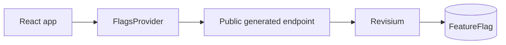

# React Feature Flags Example

This is a small Vite React app that reads public feature flag rows from Revisium. The schema and seed data live in `../bootstrap.config.json`; this folder is the application side.

## Architecture



## Runtime Safety

This browser-only example uses a public generated endpoint instead of `@revisium/client`, because Vite environment variables are shipped to the browser. Keep write-capable credentials in backend or server-rendered examples.

## Run

Bootstrap is done from the example root (`npm run bootstrap:react`).

Run this app from the repository root:

```bash
cd apps/react-feature-flags/project
cp .env.example .env
npm install
npm run dev
```

Open the Vite URL printed in the terminal.

## Environment

```env
VITE_REVISIUM_PUBLIC_FEATURE_FLAG_TABLE_URL=http://localhost:9222/endpoint/rest/admin/frontend-config/master/head/FeatureFlag
```

For Docker Compose, use port `8080`. For Cloud, use the generated endpoint under `https://cloud.revisium.io/endpoint/rest/...`.

## Code Map

| Path | Purpose |
| --- | --- |
| `src/features/flags/flags-client.ts` | Loads and normalizes public flag rows |
| `src/features/flags/FlagsProvider.tsx` | Provides flag state to React |
| `src/features/flags/useFlag.ts` | Reads one flag by row ID |
| `src/App.tsx` | Demo UI controlled by `checkout-v2` |
