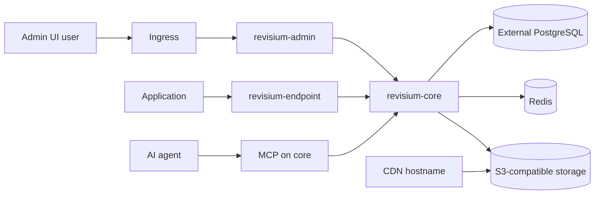

# Cloud on Kubernetes

Reference example for a multi-service Revisium deployment on Kubernetes.

This example follows the same broad pattern as the current cloud setup:

- `revisium-admin`
- `revisium-core`
- `revisium-endpoint`
- `redis`
- external PostgreSQL
- external S3-compatible storage
- public CDN hostname for file delivery

## Layout

- [`core-values.yaml`](./core-values.yaml)
- [`admin-values.yaml`](./admin-values.yaml)
- [`endpoint-values.yaml`](./endpoint-values.yaml)
- [`redis-values.yaml`](./redis-values.yaml)
- [`namespace.yaml`](./namespace.yaml)

## Supported Modes

| Mode | URL | Notes |
| --- | --- | --- |
| Kubernetes | `https://cloud.example.com` | Self-hosted multi-service deployment |

## Assumptions

- namespace: `cloud`
- public host: `cloud.example.com`
- public CDN host: `cdn.example.com`
- ingress-nginx installed
- cert-manager installed
- PostgreSQL managed outside the cluster

## Secret

Create `app-secret` from the shared template:

Run commands from the repository root.

```bash
kubectl create secret generic app-secret \
  --from-env-file=templates/secrets/app-secret.env.example \
  -n cloud \
  --dry-run=client -o yaml | kubectl apply -f -
```

Replace placeholder values before applying.

## Run

This example assumes you use the Helm charts from `revisium/infrastructure`.
Run commands from the repository root and point `CHART_ROOT` at the Revisium infrastructure chart directory.

| Step | Command | Notes |
| --- | --- | --- |
| 1 | `kubectl apply -f namespace.yaml` | Creates namespace |
| 2 | `kubectl create secret generic app-secret ...` | Uses the shared secret template |
| 3 | `helm upgrade --install cloud-redis ...` | Installs Redis |
| 4 | `helm upgrade --install cloud-core ...` | Installs Core API |
| 5 | `helm upgrade --install cloud-endpoint ...` | Installs generated endpoint service |
| 6 | `helm upgrade --install cloud-admin ...` | Installs Admin UI |

```bash
CHART_ROOT=/path/to/revisium/infrastructure/development/cloud

kubectl apply -f infrastructure/kubernetes/cloud/namespace.yaml

helm upgrade --install cloud-redis "$CHART_ROOT/redis" \
  -n cloud \
  -f infrastructure/kubernetes/cloud/redis-values.yaml

helm upgrade --install cloud-core "$CHART_ROOT/core" \
  -n cloud \
  -f infrastructure/kubernetes/cloud/core-values.yaml

helm upgrade --install cloud-endpoint "$CHART_ROOT/endpoint" \
  -n cloud \
  -f infrastructure/kubernetes/cloud/endpoint-values.yaml

helm upgrade --install cloud-admin "$CHART_ROOT/admin" \
  -n cloud \
  -f infrastructure/kubernetes/cloud/admin-values.yaml
```

## Architecture



## Revisium Tables

This infrastructure example does not create user tables. It provides the platform where application examples create tables.

| Example table | Created by | Purpose |
| --- | --- | --- |
| `FeatureFlag` | Remote config examples | Runtime configuration |
| `FaqCategory`, `FaqItem` | Dictionary service examples | Reference data with FK relationships |
| `Asset` | File examples | File upload and public URL validation |

## Verify

```bash
kubectl get pods -n cloud
kubectl get ingress -n cloud
curl -fsS https://cloud.example.com/api/health
```

## Notes

- `core` and `endpoint` share the same `DATABASE_URL`
- `TRUST_PROXY=2` matches the chain `ingress-nginx -> admin nginx -> core`
- `FILE_PLUGIN_PUBLIC_ENDPOINT` should point to the CDN hostname, not the S3 origin
- The endpoint chart is named `application`; installing it as `cloud-endpoint` renders the service `cloud-endpoint-application`
- The current Redis chart does not wire Redis AUTH values; keep Redis private to the namespace or extend the chart before using it in stricter environments
