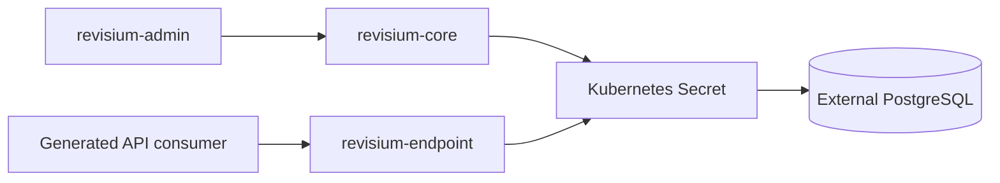

# External PostgreSQL

Revisium production-style deployments should prefer an external PostgreSQL service instead of PostgreSQL running inside the same Kubernetes cluster.

## What This Shows

- one PostgreSQL database shared by `revisium-core` and `revisium-endpoint`
- database connection through Kubernetes secrets
- separation between platform data and optional billing databases

## Supported Modes

| Mode | URL | Notes |
| --- | --- | --- |
| Kubernetes | `postgresql://...` | Used by self-hosted cloud deployments |

## Why

- simpler backup strategy
- easier upgrades
- less coupling between app lifecycle and database lifecycle
- better fit for long-lived environments

## Main Rule

`revisium-core` and `revisium-endpoint` should use the same `DATABASE_URL`.

Example:

```text
postgresql://revisium:<password>@pg.example.com:5432/revisium?schema=public
```

## Optional Billing Databases

If you deploy billing:

- `PAYMENT_DATABASE_URL`
- `PAYMENT_CONFIG_DATABASE_URL`

These should be separate databases.

## Run

| Step | Command | Notes |
| --- | --- | --- |
| 1 | Create managed PostgreSQL database | Outside the Kubernetes cluster |
| 2 | Create Kubernetes secret | Store `DATABASE_URL` |
| 3 | Reference secret from Helm values | Used by core and endpoint |

Kubernetes secret example:

```bash
kubectl create secret generic app-secret \
  --from-literal=DATABASE_URL='postgresql://revisium:<password>@pg.example.com:5432/revisium?schema=public' \
  -n cloud
```

## Architecture



## Revisium Tables

This example does not define user-facing Revisium tables. PostgreSQL stores Revisium platform data and user-created table rows.

| Data category | Stored in PostgreSQL | Created by |
| --- | --- | --- |
| Organizations, projects, branches, revisions | Yes | Revisium platform |
| Table schemas | Yes | Admin UI, CLI, System API, or MCP |
| Row data | Yes | Application examples or users |
| Files | Metadata only | Blob bytes should live in S3/CDN setup |

## Verify

```bash
kubectl get secret app-secret -n cloud
kubectl exec -n cloud deploy/cloud-core -- sh -c 'case "$DATABASE_URL" in *"pg.example.com"*) echo "DATABASE_URL host matches";; "") echo "DATABASE_URL is missing"; exit 1;; *) echo "DATABASE_URL is set but host differs"; exit 1;; esac'
```

Do not print real secret values in shared logs. Confirm only that the variable exists and points to the expected host.
