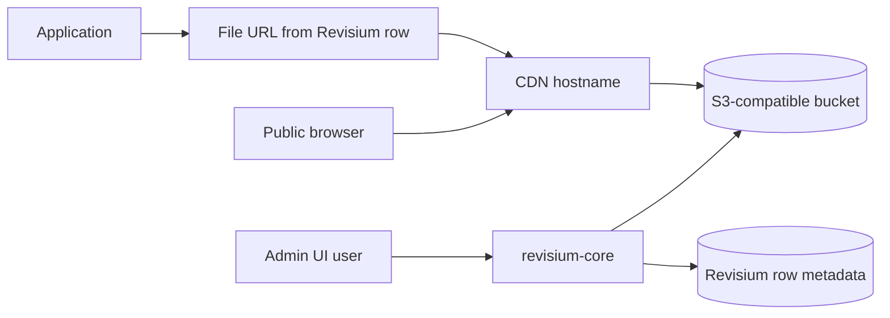

# S3 + CDN

Recommended file-delivery pattern for Revisium:

## What This Shows

- upload files to S3-compatible object storage
- expose public file URLs through a CDN hostname
- keep upload endpoint and public delivery endpoint separate

## Supported Modes

| Mode | URL | Notes |
| --- | --- | --- |
| Docker Compose | `http://localhost:8080` | Local file-storage parity |
| Kubernetes | `https://cloud.example.com` | Self-hosted deployment |

## Required Variables

```env
FILE_PLUGIN_PUBLIC_ENDPOINT=https://cdn.example.com
S3_ENDPOINT=https://s3.example.com
S3_REGION=us-east-1
S3_BUCKET=revisium-files
S3_ACCESS_KEY_ID=change-me
S3_SECRET_ACCESS_KEY=change-me
```

## Important Distinction

- `S3_ENDPOINT` is where the application uploads files
- `FILE_PLUGIN_PUBLIC_ENDPOINT` is what users receive in file URLs

These usually should not be the same hostname.

## CDN Rules

For the file CDN:

- long cache TTL is fine
- immutable hashed files are ideal
- keep the bucket private unless your storage/CDN model requires public reads

## App Example

```yaml
env:
  - name: FILE_PLUGIN_PUBLIC_ENDPOINT
    value: "https://cdn.example.com"
  - name: S3_ENDPOINT
    value: "https://s3.example.com"
  - name: S3_REGION
    value: "us-east-1"
  - name: S3_BUCKET
    value: "revisium-files"
```

## Run

| Step | Action | Notes |
| --- | --- | --- |
| 1 | Create S3 bucket | Use private bucket unless CDN model requires otherwise |
| 2 | Configure CDN hostname | Example: `https://cdn.example.com` |
| 3 | Set S3 env vars | Used for uploads |
| 4 | Set `FILE_PLUGIN_PUBLIC_ENDPOINT` | Used in generated file URLs |
| 5 | Restart Revisium service | Pick up new env values |

## Architecture



## Revisium Tables

Use a table with a file field to validate the setup.

| Table | Fields | Purpose |
| --- | --- | --- |
| `Asset` | `title`, `file` | Upload a file and verify the public CDN URL |
| `Product` | `name`, `image` | Common production-style file relationship |

The file field should use the Revisium file schema in the Admin UI. Store file metadata in Revisium and blob bytes in S3.

## Verify

```bash
curl -fsS https://cdn.example.com/<uploaded-file-path>
```

Then open the row in Admin UI and confirm the file URL starts with `FILE_PLUGIN_PUBLIC_ENDPOINT`.
