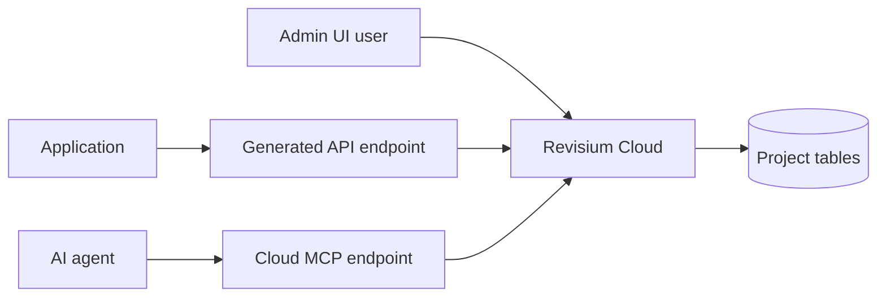

# Revisium Cloud Quickstart

Create a managed Revisium project and use it through Admin UI, generated APIs, and MCP.

## What This Shows

- managed Revisium setup without Docker or Kubernetes
- project and table creation through the Admin UI
- generated API endpoint usage
- MCP access for AI agents

## Supported Modes

| Mode | URL | Notes |
| --- | --- | --- |
| Revisium Cloud | `https://cloud.revisium.io` | This example's primary mode |

For local parity, use the same organization/project/branch naming against standalone or Docker.

## Prerequisites

- Revisium Cloud account
- Organization where you can create projects
- API key or interactive MCP login, depending on client

## Run

| Step | Action | Notes |
| --- | --- | --- |
| 1 | Sign in to `https://cloud.revisium.io` | Use Google or GitHub login |
| 2 | Create project `remote-config` | Any organization where you have access |
| 3 | Create and commit tables | Start with `FeatureFlag` |
| 4 | Enable generated endpoint | Use `master/head` for stable reads |
| 5 | Add MCP server | Use `https://cloud.revisium.io/mcp` |

## Architecture



## Revisium Tables

| Table | Fields | Purpose |
| --- | --- | --- |
| `FeatureFlag` | `enabled`, `rollout`, `description` | Remote config demo |
| `PageCopy` | `title`, `body` | Optional public content demo |

Minimal `FeatureFlag` schema:

```json
{
  "type": "object",
  "properties": {
    "enabled": { "type": "boolean", "default": false },
    "rollout": { "type": "number", "default": 0 },
    "description": { "type": "string", "default": "" }
  },
  "required": ["enabled", "rollout", "description"],
  "additionalProperties": false
}
```

## MCP

```bash
claude mcp add --transport http revisium-cloud https://cloud.revisium.io/mcp
```

Example MCP URI shape:

```text
<organization>/<project>/master:head
```

Example calls:

```text
get_tables(uri: "my-org/remote-config/master:head")
search_rows(uri: "my-org/remote-config/master:head", query: "enabled")
```

## Verify

Use the Admin UI to confirm the revision is committed, then query the generated endpoint or inspect rows via MCP.

## Docs

- Quick start: https://docs.revisium.io/quick-start
- MCP: https://docs.revisium.io/apis/mcp
- Configuration store: https://docs.revisium.io/use-cases/configuration-store
