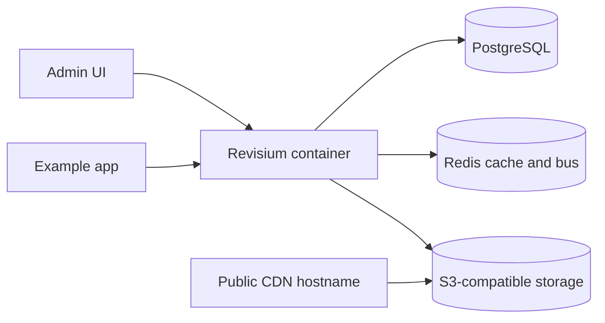

# Docker Compose with S3 and Redis

This example is closer to a production-style deployment:

## What This Shows

- PostgreSQL
- Redis
- Revisium
- external S3-compatible object storage
- public file URLs through a dedicated public endpoint

## Supported Modes

| Mode | URL | Notes |
| --- | --- | --- |
| Docker Compose | `http://localhost:8080` | This example's primary mode |

## Files

- [`docker-compose.yml`](./docker-compose.yml)
- [`.env.example`](./.env.example)

## Run

| Step | Command | Notes |
| --- | --- | --- |
| 1 | `cp .env.example .env` | Fill S3 and CDN settings |
| 2 | `docker compose up -d` | Starts PostgreSQL, Redis, and Revisium |
| 3 | Open `http://localhost:8080` | Login and test file upload |

```bash
cp .env.example .env
docker compose up -d
```

Open:

- `http://localhost:8080`

## Architecture



## Revisium Tables

This quickstart is mainly for file storage. Use a table with a file field after startup:

| Table | Fields | Purpose |
| --- | --- | --- |
| `Asset` | `title`, `file` | Upload files and verify public CDN URLs |
| `FeatureFlag` | `enabled`, `rollout`, `description` | Optional config smoke test |

The `file` field should use the Revisium file schema in the Admin UI.

## Verify

```bash
curl -fsS http://localhost:8080/api/health
```

Then upload a file through the Admin UI and confirm the returned URL uses `FILE_PLUGIN_PUBLIC_ENDPOINT`.

## Docs

- Files: https://docs.revisium.io/core-concepts/files
- Deployment: https://docs.revisium.io/deployment

## Important

`FILE_PLUGIN_PUBLIC_ENDPOINT` should usually be your public CDN hostname, not the raw S3 hostname.

Docker Compose uses Redis on `6379`; the Kubernetes Helm chart exposes its Redis service on `8080`.
