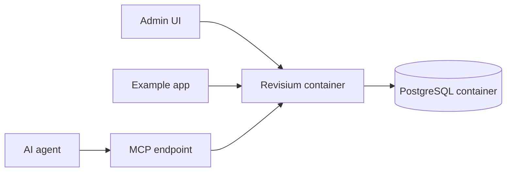

# Docker Compose Quickstart

The smallest Docker-based Revisium setup for local development.

## What This Shows

- PostgreSQL
- Revisium service
- local generated APIs and Admin UI on one public port

## Supported Modes

| Mode | URL | Notes |
| --- | --- | --- |
| Docker Compose | `http://localhost:8080` | This example's primary mode |

For zero-config local development without Docker, use [`quickstarts/standalone`](../standalone).

## Files

- [`docker-compose.yml`](./docker-compose.yml)
- [`.env.example`](./.env.example)

## Run

| Step | Command | Notes |
| --- | --- | --- |
| 1 | `cp .env.example .env` | Replace placeholder secrets first |
| 2 | `docker compose up -d` | Starts PostgreSQL and Revisium |
| 3 | Open `http://localhost:8080` | Login and create a project |

```bash
cp .env.example .env
docker compose up -d
```

Open:

- `http://localhost:8080`

Default login:

- user: `admin`
- password: value of `ADMIN_PASSWORD`

## Architecture



## Revisium Tables

This quickstart does not create tables automatically. Use this minimum model after startup:

| Table | Fields | Purpose |
| --- | --- | --- |
| `FeatureFlag` | `enabled`, `rollout`, `description` | Remote config smoke test |
| `FaqCategory` | `name`, `slug` | Dictionary service parent table |
| `FaqItem` | `question`, `answer`, `categoryId` | Dictionary service child table with FK to `FaqCategory` |

## Verify

```bash
curl -fsS http://localhost:8080/api/health
```

If the health endpoint is unavailable in the image you are testing, open the Admin UI and confirm login works.

## Docs

- Deployment: https://docs.revisium.io/deployment
- Quick start: https://docs.revisium.io/quick-start

## Notes

- this example is for local development and demos
- database migrations run on application startup
- use the S3 example if you want file storage close to production
