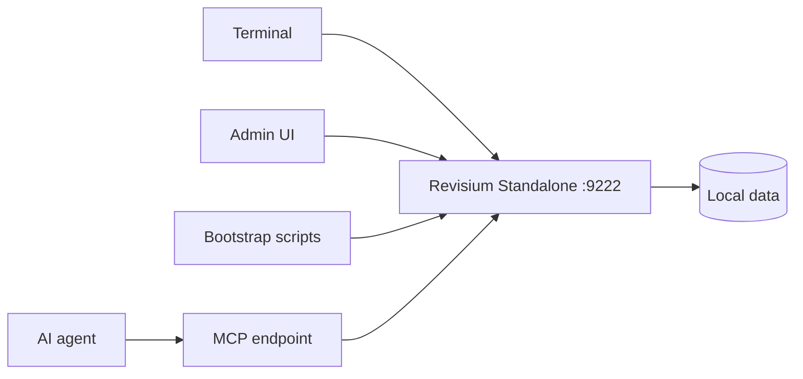

# Standalone Quickstart

Run Revisium locally with one command and no external services.

## What This Shows

- local Admin UI on `http://localhost:9222`
- local System API, generated APIs, and MCP endpoint
- writable demo projects for the app examples in this repo

## Prerequisites

Install Node.js 22.13.0 or newer. Node.js includes `npm` and `npx`.

```bash
node --version
npm --version
```

## Run

Start standalone in terminal 1:

```bash
npx @revisium/standalone@latest
```

Open:

```text
http://localhost:9222
```

Local standalone runs without auth by default.

The repository commits `.revisium/revisium-cli.config.json`, so bootstrap
commands can use named local contexts without `--url` or auth flags.

Bootstrap demos from terminal 2:

```bash
npm install
npm run bootstrap:all
```

Or run individual demos one at a time:

```bash
npm run bootstrap:nestjs
npm run bootstrap:nextjs
npm run bootstrap:react
npm run bootstrap:mcp-kb
```

Use one standalone process for all demos. Keep bootstrap commands sequential so
project creation and commits do not race each other.

Stop standalone from terminal 1:

```text
Ctrl+C
```

## Check Running Process

```bash
curl -fsS http://localhost:9222 >/dev/null && echo "standalone is up" || echo "start standalone first"
lsof -iTCP:9222 -sTCP:LISTEN
```

If port `9222` is already in use, reuse that standalone process or stop it before
starting a new one.

## Architecture



## Revisium Tables

The app examples create these local projects:

| Project | Main tables |
| --- | --- |
| `dictionary` | `FaqCategory`, `FaqItem`, `Country`, `Currency` |
| `web-config` | `FeatureFlag`, `PageCopy`, `Plan` |
| `frontend-config` | `FeatureFlag`, `AudienceSegment`, `Asset` |
| `knowledge-base` | `facts`, `decisions`, `tasks`, `blockers`, `sessions` |

## Create Data Manually

1. Open `http://localhost:9222`.
2. Create a project.
3. Create tables and rows.
4. Commit the revision so generated endpoints can read `master/head`.

## Verify

```bash
curl -fsS http://localhost:9222 >/dev/null && echo "standalone is up"
```

## Docs

- Quick start: https://docs.revisium.io/quick-start
- MCP: https://docs.revisium.io/apis/mcp
- Generated APIs: https://docs.revisium.io/apis/generated-apis
