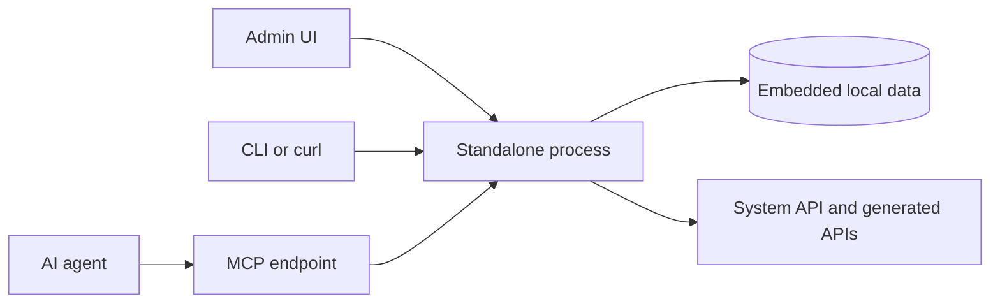

# Standalone Quickstart

Run Revisium locally with one command and no external services.

## What This Shows

- fastest local Revisium setup
- embedded storage for demos and development
- Admin UI, System API, generated APIs, and MCP from one local process

## Supported Modes

| Mode | URL | Notes |
| --- | --- | --- |
| Standalone | `http://localhost:9222` | This example's primary mode |

Use Docker Compose when you need an external PostgreSQL container.

## Prerequisites

- Node.js 22+
- npm or npx

## Run

| Step | Command | Notes |
| --- | --- | --- |
| 1 | `npx @revisium/standalone@latest` | Starts Admin UI, APIs, and MCP on port `9222` |
| 2 | Open `http://localhost:9222` | Create the demo project |
| 3 | Commit revision | Makes `master/head` readable by generated endpoints |

```bash
npx @revisium/standalone@latest
```

Open:

- Admin UI: `http://localhost:9222`
- MCP endpoint: `http://localhost:9222/mcp`

Default local credentials are `admin` / `admin` unless overridden by environment variables.

## Architecture



## Revisium Tables

Create this minimum demo model:

| Table | Fields | Notes |
| --- | --- | --- |
| `FeatureFlag` | `enabled`, `rollout`, `description` | Remote config and feature flag demo |
| `PageCopy` | `title`, `body` | Optional headless CMS/content demo |

Minimal `FeatureFlag` schema:

```json
{
  "type": "object",
  "properties": {
    "enabled": { "type": "boolean", "default": false },
    "rollout": { "type": "number", "default": 0 },
    "description": { "type": "string", "default": "" }
  },
  "required": ["enabled", "rollout", "description"],
  "additionalProperties": false
}
```

## Create A Demo Project

1. Open the Admin UI.
2. Create organization `admin` and project `demo`.
3. Create a table, for example `FeatureFlag`.
4. Commit the revision.
5. Enable a generated REST or GraphQL endpoint from the Endpoints screen.

## MCP

```bash
claude mcp add --transport http revisium-local http://localhost:9222/mcp
```

Use the MCP tools to inspect tables and rows:

```text
get_tables(uri: "admin/demo/master:head")
search_rows(uri: "admin/demo/master:head", query: "flag")
```

## Verify

Open the Admin UI and confirm you can create a project and commit a revision.

## Docs

- Quick start: https://docs.revisium.io/quick-start
- MCP: https://docs.revisium.io/apis/mcp
- Generated APIs: https://docs.revisium.io/apis/generated-apis
