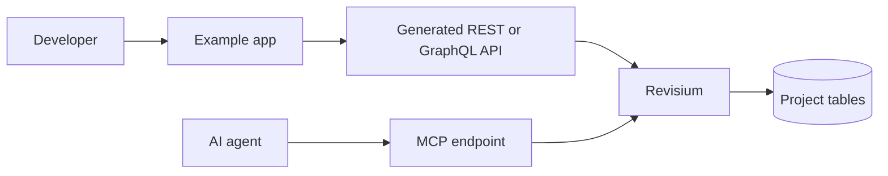

# Example Title

One sentence that explains the user-facing result.

## What This Shows

- Revisium capability demonstrated
- Application or infrastructure pattern demonstrated
- Which API surface is used: generated REST, generated GraphQL, System API, CLI, or MCP

## Supported Modes

| Mode | URL | Notes |
| --- | --- | --- |
| Standalone | `http://localhost:9222` | Local zero-config development |
| Docker Compose | `http://localhost:8080` | Local service with PostgreSQL |
| Revisium Cloud | `https://cloud.revisium.io` | Managed environment |

Remove unsupported rows for the concrete example.

## Prerequisites

- Node.js 22+
- Revisium instance, depending on the selected mode
- API key or user credentials when the example requires authenticated calls

## Run

| Step | Command | Notes |
| --- | --- | --- |
| 1 | `cp .env.example .env` | Fill one `REVISIUM_URL` in `revisium://` format |
| 2 | `npm install` | Only when this example contains an app package |
| 3 | `npm run dev` | Starts the example application |

```bash
# copy example env
cp .env.example .env

# install dependencies when this example has an app package
npm install

# start the example
npm run dev
```

## Architecture



## Revisium Tables

Describe:

- organization, project, and branch naming
- tables and schemas
- seed data
- endpoint type and revision target
- how to commit or promote content

## Capability Coverage

Follow [`docs/domain-demo-rules.md`](../../docs/domain-demo-rules.md) for application examples.

| Capability | Covered by | Notes |
| --- | --- | --- |
| Tables | `TableA`, `TableB`, `TableC` | At least 3 domain tables |
| Scalar FK | `TableA.parentId` | Top-level FK |
| Nested FK | `TableA.metadata.ownerId` | FK inside object |
| Array primitive FK | `TableA.relatedIds[]` | String array with `foreignKey` |
| Array object FK | `TableA.items[].itemId` | FK inside object array |
| Array primitives | `TableA.tags[]` | Primitive array |
| Array objects | `TableA.items[]` | Object array |
| File field | `TableA.image` | File schema |
| Nested file | `TableA.media.hero` | Nested file field |
| File array | `TableA.attachments[]` | Array of file objects |
| Nested file array | `TableA.media.gallery[]` | File array under object |
| Computed scalar | `TableA.total` | Simple formula |
| Computed nested | `TableA.summary.score` | Formula from nested fields |
| Computed array index | `TableA.primaryItemName` | Formula reads array index |
| Computed aggregate | `TableA.totalAmount` | Sum over array values |
| Generated API | REST or GraphQL endpoint | Read path |
| MCP | `search_rows` or `get_tables` | Agent path |

## Verify

```bash
# replace with the smallest useful smoke test
curl http://localhost:3000/health
```

## Docs

- Concept docs: `https://docs.revisium.io/...`
- API docs: `https://docs.revisium.io/apis/...`
