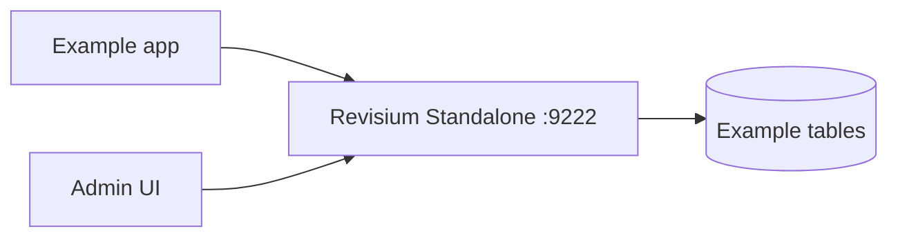

# Example Title

One sentence explaining what this example demonstrates with local Revisium Standalone.

The runnable app lives in `project/` when the example includes framework code.
Bootstrap config, seed rows, and environment contract stay at this example root.

## What This Shows

- primary use case
- data model shape
- generated API or MCP access pattern

## Prerequisites

- Node.js 22.13.0+
- one local Revisium Standalone process on `http://localhost:9222`

## Run

Terminal 1:

```bash
npx @revisium/standalone@latest
```

Terminal 2:

```bash
npm install
npm run bootstrap:example-id
```

Stop standalone from terminal 1 with `Ctrl+C`.

## Architecture



## Revisium Tables

| Table | Purpose |
| --- | --- |
| `ExampleTable` | Main demo data |

## Capability Coverage

| Capability | Covered by | Notes |
| --- | --- | --- |
| Tables | `ExampleTable` | Main table |
| Scalar FK | `ExampleTable.ownerId` | FK to another table |
| Nested FK | `ExampleTable.metadata.ownerId` | FK inside object |
| Array primitive FK | `ExampleTable.relatedIds[]` | FK array |
| Array object FK | `ExampleTable.items[].relatedId` | FK inside array object |
| Array primitives | `ExampleTable.tags[]` | Tags |
| Array objects | `ExampleTable.items[]` | Structured list |
| File field | `ExampleTable.file` | Single file |
| Nested file | `ExampleTable.media.hero` | File inside object |
| File array | `ExampleTable.files[]` | File list |
| Nested file array | `ExampleTable.media.gallery[]` | File list inside object |
| Computed scalar | `ExampleTable.summary` | Computed field |
| Computed nested | `ExampleTable.metrics.total` | Computed nested value |
| Computed array index | `ExampleTable.primaryTag` | First array value |
| Computed aggregate | `ExampleTable.total` | Aggregate value |
| Generated API | `POST /tables/ExampleTable/rows` | REST or GraphQL endpoint |
| MCP | `get_tables`, `search_rows` | Agent inspection |

## Environment

Use one base Revisium target with phase-specific revisions.

Bootstrap writes to draft:

```env
REVISIUM_URL=revisium://localhost:9222/admin/example-project/master
```

Runtime apps read committed data with `:head`:

```env
REVISIUM_URL=revisium://localhost:9222/admin/example-project/master:head
```

## See and Manage Data

- Admin UI: `http://localhost:9222`
- Generated REST endpoint:
  `http://localhost:9222/endpoint/rest/admin/example-project/master/head`
- Generated GraphQL endpoint:
  `http://localhost:9222/endpoint/graphql/admin/example-project/master/head`
- MCP endpoint: `http://localhost:9222/mcp`

## Verify

```bash
curl -fsS -X POST http://localhost:9222/endpoint/rest/admin/example-project/master/head/tables/ExampleTable/rows \
  -H 'content-type: application/json' \
  -d '{"first":10}'
```

## Docs

- Generated APIs: https://docs.revisium.io/apis/generated-apis
- MCP: https://docs.revisium.io/apis/mcp
